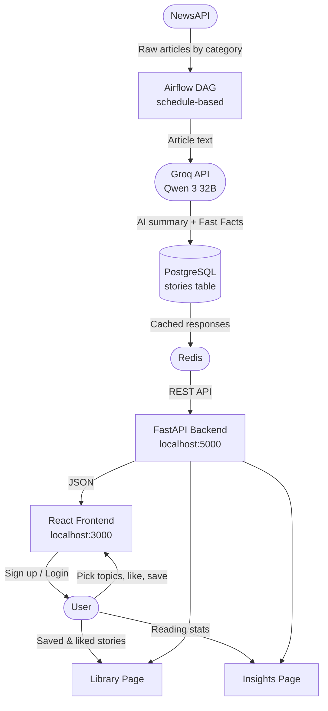

# The Global Briefing

A personalised news platform built with Airflow, FastAPI, and React. It pulls articles from NewsAPI, summarises them using Qwen 3-32B (via Groq), and presents them as a clean news feed tailored to each user's interests.

---

## How it works



**Request flow:**
1. Airflow wakes up on a schedule and calls NewsAPI for fresh articles
2. Each article body is sent to Groq — Qwen 3-32B writes a summary with a lead paragraph and Fast Facts
3. The summary lands in PostgreSQL
4. When the React app requests stories, FastAPI checks Redis first — if cached, it skips the DB call
5. The user sees a personalised feed based on their saved topic preferences

---

## Tech Stack

| What | How |
|---|---|
| Orchestration | Apache Airflow |
| AI model | Qwen 3 32B via Groq API |
| Backend | FastAPI + Uvicorn |
| Frontend | React + Tailwind CSS |
| Database | PostgreSQL 13 |
| Cache | Redis 7 |
| Auth | JWT tokens (python-jose + bcrypt) |
| Infrastructure | Docker + Docker Compose |

---

## Project Structure

```
Project_newsletter/
├── dags/
│   ├── scrape_stories.py        # Airflow DAG — fetches articles and calls Groq
│   └── match_and_trigger.py     # Matches stories to user preferences
├── backend/
│   ├── app.py                   # All FastAPI routes
│   ├── requirements.txt
│   └── Dockerfile
├── frontend/
│   ├── src/
│   │   ├── App.js               # Pages, components, auth context
│   │   ├── App.css
│   │   ├── components/
│   │   │   ├── LoginForm.js
│   │   │   └── SignupForm.js
│   │   └── pages/
│   │       ├── LoginPage.js
│   │       └── SignupPage.js
│   ├── package.json
│   └── Dockerfile
├── database/
│   └── init.sql                 # Schema — runs once on first Postgres start
├── docker-compose.yaml
├── Dockerfile                   # Airflow image
├── .env.example                 # Copy this to .env and fill in your keys
├── import_stories.py            # Utility: bulk-import stories from a CSV
├── scrub_db.py                  # Utility: remove bad/duplicate data from DB
└── requirements.txt             # Python deps for the Airflow container
```

---

## Getting Started

### What you need

- [Docker Desktop](https://www.docker.com/products/docker-desktop/) — must be running before you do anything else
- [Git](https://git-scm.com/)
- A Groq API key — free at [console.groq.com](https://console.groq.com)
- A NewsAPI key — free at [newsapi.org](https://newsapi.org)

### 1. Clone the repo

```bash
git clone https://github.com/YOUR_USERNAME/Project_newsletter.git
cd Project_newsletter
```

### 2. Set up your environment file

```bash
# Mac / Linux
cp .env.example .env

# Windows PowerShell
Copy-Item .env.example .env
```

Open `.env` and fill in the three required values:

```env
GROQ_API_KEY=your_groq_key_here
NEWSAPI_KEY=your_newsapi_key_here
JWT_SECRET=make_up_any_long_random_string
```

Everything else (database, ports) has working defaults and doesn't need to change for local development.

> `.env` is in `.gitignore` — it will never be pushed to GitHub.

### 3. Start the stack

```bash
docker compose up -d --build
```

First build takes 3–5 minutes. After that it's fast.

### 4. Verify containers are up

```bash
docker compose ps
```

All five should show `Up`. If something is restarting, check its logs:

```bash
docker compose logs backend
docker compose logs webserver
```

---

## Access Points

| Service | URL | Credentials |
|---|---|---|
| Frontend | http://localhost:3000 | Sign up with any email |
| Airflow UI | http://localhost:8081 | admin / admin |
| Backend API | http://localhost:5000 | — |
| PostgreSQL (DBeaver) | localhost:5433 | postgres / postgres |

---

## Triggering the News Scraper

Stories won't appear until you run the DAG at least once:

1. Open **http://localhost:8081**
2. Find the DAG named **`scrape_stories`**
3. Toggle it **On** (the switch on the left)
4. Click the **▶ play button** → **Trigger DAG**
5. Wait about 2 minutes — the circle should turn green
6. Refresh **http://localhost:3000** — stories appear

After the first manual run, the DAG runs on its own schedule.

---

## Using the App

- Sign up and pick at least 3 topic interests
- The home feed shows stories matching your preferences
- Click any card to open the original article
- Bookmark icon → saves to **Library**
- Heart icon → liked stories also appear in **Library**
- **Insights** tab shows reading streak, time saved, and topic breakdown

---

## Environment Variables

| Variable | Required | Notes |
|---|---|---|
| `GROQ_API_KEY` | Yes | From [console.groq.com](https://console.groq.com) |
| `NEWSAPI_KEY` | Yes | From [newsapi.org](https://newsapi.org) |
| `JWT_SECRET` | Yes | Any long random string |
| `POSTGRES_USER` | No | Default: `postgres` |
| `POSTGRES_PASSWORD` | No | Default: `postgres` |
| `POSTGRES_DB` | No | Default: `postgres` |
| `POSTGRES_EXTERNAL_PORT` | No | Default: `5433` |
| `FRONTEND_PORT` | No | Default: `3000` |
| `AIRFLOW_PORT` | No | Default: `8081` |
| `RESEND_API_KEY` | No | Only needed for email sending |

---

## API Reference

**Auth**
- `POST /api/auth/signup` — create account
- `POST /api/auth/login` — returns JWT token
- `GET /api/auth/verify` — validate token

**Stories**
- `GET /api/stories` — all stories, supports `?category=`, `?search=`, `?date=`
- `POST /api/stories/{id}/like` — toggle like
- `POST /api/stories/{id}/save` — toggle save

**Library**
- `GET /api/library/saved` — saved stories
- `GET /api/library/liked` — liked stories

**Preferences**
- `GET /api/preferences` — get topics
- `POST /api/preferences` — update topics

**Insights**
- `GET /api/insights/topics` — category breakdown
- `GET /api/insights/reading-stats` — streak, time saved, peak time

**System**
- `GET /api/health` — health check

---

## Database Tables

| Table | What's in it |
|---|---|
| `users` | id, name, email, hashed password |
| `preferences` | user_id, category |
| `stories` | story_id (VARCHAR), title, summary, category, url, cover_image, published_at |
| `newsletter` | scheduled newsletter records |
| `sent_emails` | delivery log |
| `click_events` | likes, saves, reads — used for Library and Insights |

---

## Common Issues

**No stories after DAG run** — check the DAG run is green in Airflow, and that both `GROQ_API_KEY` and `NEWSAPI_KEY` are set in `.env`. Task-level logs are in Airflow UI → click the DAG run → click any task box → Logs.

**"Failed to fetch" on the website** — the backend container isn't running. Check with `docker compose ps` and read logs with `docker compose logs backend`.

**Port conflict** — another app is using the port:
```bash
# Windows
netstat -ano | findstr :3000
taskkill /PID <PID> /F
```

**Missing tables / fresh start needed**
```bash
docker compose down -v
docker compose up -d --build
```

---

## Resetting or Rebuilding

```bash
# Stop everything, keep data
docker compose down

# Stop and wipe all data
docker compose down -v

# Rebuild one service after a code change
docker compose up -d --build backend
docker compose up -d --build frontend
```

---

## License

MIT
